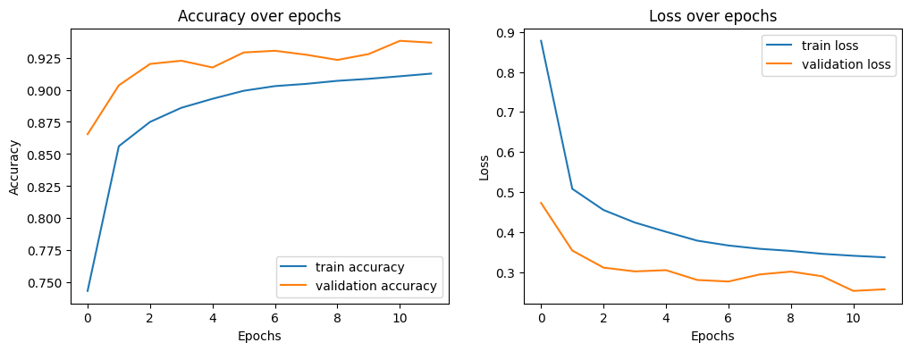
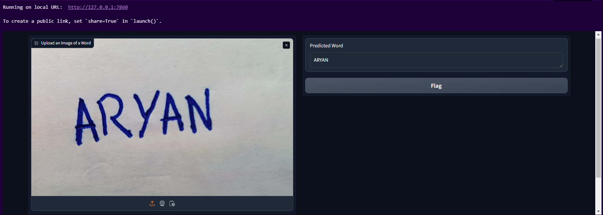
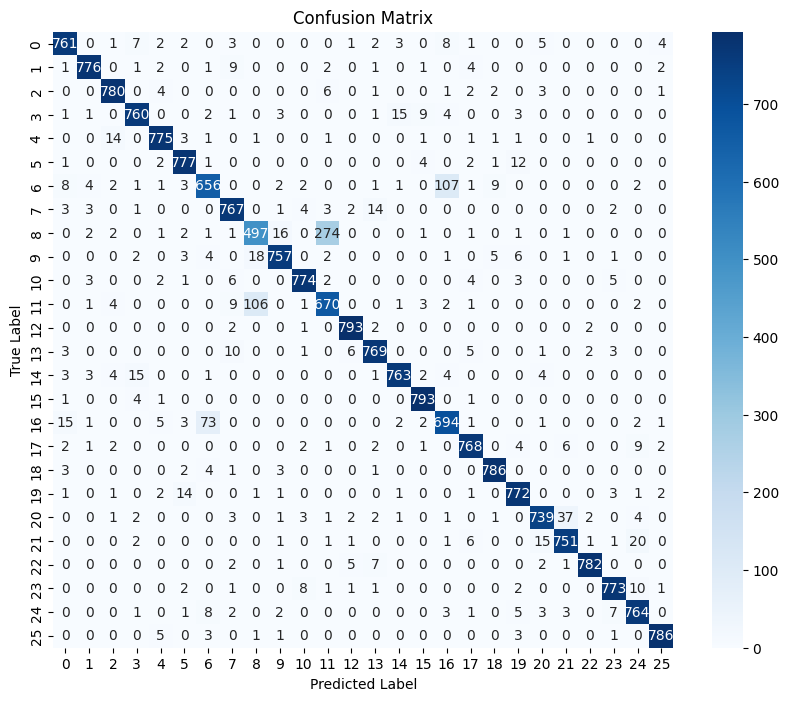

# Handwritten Character Recognition using EMNIST Dataset

This project implements **Handwritten Character Recognition** using the **EMNIST Dataset**, a dataset that extends the popular MNIST dataset by including both digits and letters. The goal is to build a deep learning model that can accurately recognize handwritten characters and digits.

## Table of Contents

1. [Overview](#overview)
2. [Project Setup](#project-setup)
3. [Dataset](#dataset)
4. [Model Architecture](#model-architecture)
5. [Results](#results)
6. [Usage](#usage)
7. [Contributing](#contributing)
8. [License](#license)

## Overview

The **Handwritten Character Recognition** model uses convolutional neural networks (CNNs) to classify characters from the EMNIST dataset into their respective categories. The model is trained on both digits (0-9) and letters (A-Z), providing a robust solution for handwritten text recognition.

### Link to the repository: [GitHub Repository](https://github.com/AryanMithbawkar/Handwritten-Character-Recognition-using-EMNIST-Dataset)

## Project Setup

### Requirements

- Python 3.7 or higher
- TensorFlow
- Keras
- Scikit-learn
- Matplotlib
- NumPy
- Pandas

To install the required libraries, run:

```bash
pip install -r requirements.txt
```

## Folder Structure

```bash
.
├── model.h5
├── output1.png
├── output2.png
├── output3.png
│── handwritten_character_recognition.ipynb
├── README.md
```

## Dataset

The **EMNIST Dataset** is an extension of the MNIST dataset and consists of 814,255 characters across 26 classes (26 uppercase/lowercase letters). It is designed to evaluate machine learning models for character recognition.

- Training set: 697,932 characters
- Test set: 116,323 characters
  The dataset is already split into training and test sets and can be loaded using the emnist Python package or manually from CSV files.

## Model Architecture

The model is built using Convolutional Neural Networks (CNNs), which are well-suited for image classification tasks.

## Model Structure

- **Input Layer**: 28x28 grayscale image input
- **Convolutional Layers**: 2 convolutional layers with ReLU activation and MaxPooling
- **Dense Layers**: 2 dense layers for classification
- **Output Layer**: Softmax layer with 27 outputs (26 letters + 1 extra class for indexing)

```python
model = Sequential([
    tf.keras.Input(shape=(28,28,1)),
    Conv2D(32, (3, 3), activation='relu',kernel_regularizer=regularizers.l2(0.0001)),
    BatchNormalization(),
    MaxPooling2D(pool_size=(2, 2)),
    Conv2D(64, (3, 3), activation='relu',kernel_regularizer=regularizers.l2(0.0001)),
    BatchNormalization(),
    MaxPooling2D(pool_size=(2, 2)),
    Flatten(),
    Dense(128, activation='relu',kernel_regularizer=regularizers.l2(0.0001)),
    Dropout(0.5),
    Dense(27, activation='softmax',kernel_regularizer=regularizers.l2(0.0001))  # 26 letters + 1 extra class for indexing
])
```

## Model Summary:

| Layer (type)                   | Output Shape       | Param # |
| ------------------------------ | ------------------ | ------- |
| conv2d (Conv2D)                | (None, 26, 26, 32) | 320     |
| batch_normalization            | (None, 26, 26, 32) | 128     |
| (BatchNormalization)           |                    |         |
| max_pooling2d (MaxPooling2D)   | (None, 13, 13, 32) | 0       |
| conv2d_1 (Conv2D)              | (None, 11, 11, 64) | 18,496  |
| batch_normalization_1          | (None, 11, 11, 64) | 256     |
| (BatchNormalization)           |                    |         |
| max_pooling2d_1 (MaxPooling2D) | (None, 5, 5, 64)   | 0       |
| flatten (Flatten)              | (None, 1600)       | 0       |
| dense (Dense)                  | (None, 128)        | 204,928 |
| dense_1 (Dense)                | (None, 27)         | 3,483   |

## Compilation

```python
model.compile(optimizer='adam', loss='categorical_crossentropy', metrics=['accuracy'])
```

## Results

The model achieves high accuracy on the EMNIST test set, with character recognition.

1. Accuracy and Loss over Epochs:

   - 

2. Example Predictions:
   - 
3. Confusion Matrix:
   - 

## Usage

To use the model for character recognition, follow these steps:

1. Clone the repository:

```bash
git clone https://github.com/AryanMithbawkar/Handwritten-Character-Recognition-using-EMNIST-Dataset
```

2. Train the model using the provided notebook:

```bash
jupyter notebook notebooks/handwritten_character_recognition.ipynb
```

3. Optionally, use the pre-trained model:

```python
from tensorflow.keras.models import load_model

model = load_model('models/model.h5')
```

4. Input an image of a handwritten character, and the model will predict the class.

## Contributing

Contributions are welcome! Feel free to open issues or submit pull requests to improve the model, code, or documentation.

- Steps to Contribute:
  - Fork the repository
  - Create a new branch for your changes
  - Commit your changes and create a pull request

## License

This project is licensed under the MIT License - see the LICENSE file for details.

## Acknowledgments

- TensorFlow: For providing the deep learning framework.
- Kaggle: For hosting datasets and resources.
- EMNIST: For the dataset used in this project.
